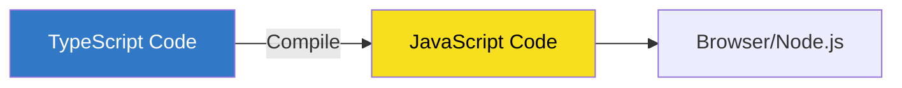
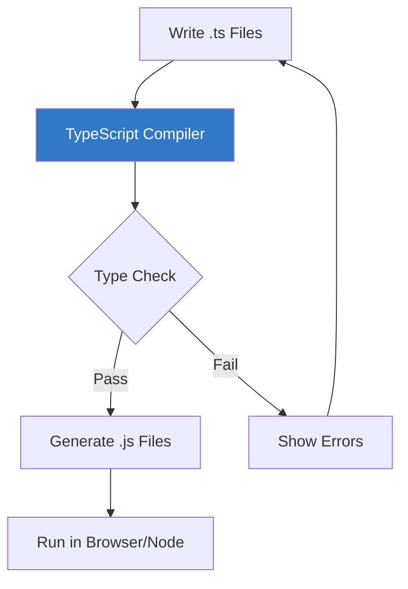
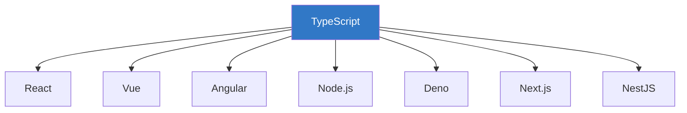

# Chapter 1.1: Introduction to TypeScript

## What is TypeScript?

**TypeScript** is a strongly typed superset of JavaScript developed and maintained by Microsoft. It adds optional static typing and class-based object-oriented programming to the language.



## Why TypeScript?

### The Problem with JavaScript

```javascript
// JavaScript - No type safety
function add(a, b) {
    return a + b;
}

add(5, 10);       // 15 ✓
add("5", 10);     // "510" - Unexpected string concatenation!
add(null, 10);    // 10 - null coerced to 0
```

### The TypeScript Solution

```typescript
// TypeScript - Type safety at compile time
function add(a: number, b: number): number {
    return a + b;
}

add(5, 10);       // 15 ✓
add("5", 10);     // ❌ Error: Argument of type 'string' is not assignable to parameter of type 'number'
add(null, 10);    // ❌ Error: Argument of type 'null' is not assignable to parameter of type 'number'
```

---

## TypeScript vs JavaScript

| Feature | JavaScript | TypeScript |
|---------|-----------|------------|
| Type System | Dynamic | Static (optional) |
| Error Detection | Runtime | Compile time |
| IDE Support | Basic | Rich IntelliSense |
| Code Refactoring | Risky | Safe |
| Learning Curve | Lower | Slightly higher |
| Execution | Direct | Requires compilation |

---

## How TypeScript Works



### Compilation Process

1. **Write** TypeScript code in `.ts` files
2. **Compile** using `tsc` (TypeScript Compiler)
3. **Check** for type errors at compile time
4. **Output** JavaScript that runs anywhere

---

## Key Benefits

### 1. Early Error Detection

```typescript
interface User {
    name: string;
    age: number;
}

function greet(user: User) {
    // TypeScript knows exactly what properties exist
    console.log(`Hello, ${user.name}! You are ${user.age} years old.`);
}

// ❌ Compile-time error - missing 'age' property
greet({ name: "Alice" });
```

### 2. Excellent IDE Support

```typescript
const user = {
    name: "Bob",
    email: "bob@example.com"
};

// IDE provides autocomplete for 'name' and 'email'
user.  // <-- IntelliSense shows available properties
```

### 3. Self-Documenting Code

```typescript
// Types serve as inline documentation
function calculateTotal(
    price: number,
    quantity: number,
    discount?: number  // Optional parameter
): number {
    const subtotal = price * quantity;
    return discount ? subtotal * (1 - discount) : subtotal;
}
```

### 4. Safe Refactoring

When you rename a property or function, TypeScript ensures all usages are updated correctly.

---

## TypeScript Ecosystem



TypeScript is widely adopted across the JavaScript ecosystem:

- **Frontend**: React, Vue, Angular, Svelte
- **Backend**: Node.js, Deno, Bun
- **Frameworks**: Next.js, NestJS, Nuxt
- **Mobile**: React Native, Ionic

---

## Your First TypeScript Program

```typescript
// hello.ts
function greet(name: string): string {
    return `Hello, ${name}!`;
}

const message = greet("World");
console.log(message);  // Output: Hello, World!
```

**Compile and run:**
```bash
npx tsc hello.ts       # Compiles to hello.js
node hello.js          # Runs the JavaScript
```

---

## Best Practices

> [!TIP]
> **Start Gradually** - You don't need to type everything at once. TypeScript's inference handles most cases.

> [!IMPORTANT]
> **Use Strict Mode** - Enable `strict: true` in tsconfig.json for maximum type safety.

> [!NOTE]
> **Leverage Your IDE** - VS Code + TypeScript provides the best developer experience.

---

## Summary

| Concept | Description |
|---------|-------------|
| TypeScript | Typed superset of JavaScript |
| Static Typing | Errors caught at compile time |
| Type Inference | TypeScript can infer types automatically |
| Compilation | `.ts` → `.js` via `tsc` |
| Compatibility | All valid JS is valid TS |

---

## Next Steps

Continue to [Chapter 1.2: Setup and Configuration →](../1.2-setup-configuration/README.md)
