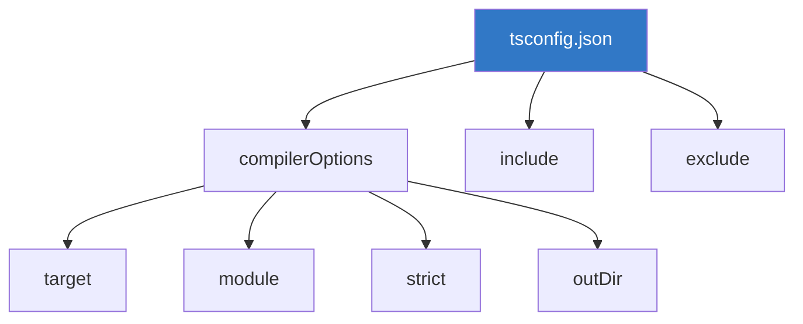
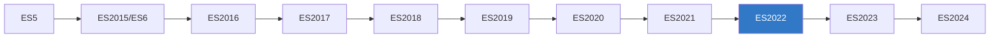

# Chapter 1.2: Setup and Configuration

## Prerequisites

Before we begin, ensure you have:
- **Node.js** v18+ installed ([Download](https://nodejs.org))
- **VS Code** or another code editor ([Download](https://code.visualstudio.com))

Verify Node.js installation:
```bash
node --version   # Should show v18.x or higher
npm --version    # Should show 9.x or higher
```

---

## Installing TypeScript

### Global Installation

```bash
# Install TypeScript globally
npm install -g typescript

# Verify installation
tsc --version    # Should show Version 5.7.x
```

### Local Project Installation (Recommended)

```bash
# Create a new project
mkdir my-ts-project
cd my-ts-project

# Initialize npm
npm init -y

# Install TypeScript as dev dependency
npm install --save-dev typescript

# Verify
npx tsc --version
```

---

## Understanding tsconfig.json

The `tsconfig.json` file is the heart of TypeScript configuration.



### Generate tsconfig.json

```bash
npx tsc --init
```

This creates a `tsconfig.json` with commented options.

---

## Essential Compiler Options

### Recommended Starter Configuration

```json
{
    "compilerOptions": {
        // Target JavaScript version
        "target": "ES2022",
        
        // Module system
        "module": "NodeNext",
        "moduleResolution": "NodeNext",
        
        // Strict type checking (HIGHLY RECOMMENDED)
        "strict": true,
        
        // Output directory
        "outDir": "./dist",
        "rootDir": "./src",
        
        // Additional checks
        "esModuleInterop": true,
        "skipLibCheck": true,
        "forceConsistentCasingInFileNames": true,
        
        // Source maps for debugging
        "sourceMap": true,
        
        // Declaration files
        "declaration": true
    },
    "include": ["src/**/*"],
    "exclude": ["node_modules", "dist"]
}
```

---

## Compiler Options Deep Dive

### Target

Specifies the ECMAScript version for output JavaScript.

```json
"target": "ES2022"  // Modern browsers/Node.js
"target": "ES5"     // Legacy browser support
"target": "ES2024"  // Latest (TypeScript 5.7+)
```



### Module System

```json
"module": "NodeNext"     // Node.js with ESM support
"module": "CommonJS"     // Node.js (legacy)
"module": "ESNext"       // Latest ES modules
```

### Strict Mode Options

`"strict": true` enables all of these:

| Option | Description |
|--------|-------------|
| `strictNullChecks` | `null` and `undefined` are distinct types |
| `strictFunctionTypes` | Stricter function type checking |
| `strictBindCallApply` | Check `bind`, `call`, `apply` |
| `strictPropertyInitialization` | Class properties must be initialized |
| `noImplicitAny` | Error on expressions with implied `any` |
| `noImplicitThis` | Error on `this` with implied `any` |
| `alwaysStrict` | Parse in strict mode, emit "use strict" |

> [!IMPORTANT]
> Always enable `strict: true` for new projects. It catches many common errors.

---

## Project Structure

### Recommended Folder Layout

```
my-ts-project/
├── src/
│   ├── index.ts         # Entry point
│   ├── types/           # Type definitions
│   │   └── index.d.ts
│   ├── utils/           # Utility functions
│   │   └── helpers.ts
│   └── models/          # Data models
│       └── user.ts
├── dist/                # Compiled output (gitignore this)
├── node_modules/
├── package.json
├── tsconfig.json
└── .gitignore
```

### .gitignore for TypeScript Projects

```gitignore
# Dependencies
node_modules/

# Build output
dist/
build/

# TypeScript cache
*.tsbuildinfo

# IDE
.vscode/
.idea/

# Environment
.env
.env.local
```

---

## Running TypeScript

### Method 1: Compile and Run

```bash
# Compile
npx tsc

# Run the compiled JavaScript
node dist/index.js
```

### Method 2: Watch Mode

```bash
# Auto-recompile on file changes
npx tsc --watch
```

### Method 3: ts-node (Development)

```bash
# Install ts-node
npm install --save-dev ts-node

# Run TypeScript directly
npx ts-node src/index.ts
```

### Method 4: tsx (Fast Alternative)

```bash
# Install tsx
npm install --save-dev tsx

# Run with watch mode
npx tsx watch src/index.ts
```

---

## VS Code Setup

### Essential Extensions

1. **TypeScript and JavaScript Language Features** (built-in)
2. **ESLint** - Linting
3. **Prettier** - Code formatting
4. **Error Lens** - Inline error display

### VS Code Settings

Create `.vscode/settings.json`:

```json
{
    "typescript.preferences.importModuleSpecifier": "relative",
    "typescript.updateImportsOnFileMove.enabled": "always",
    "editor.formatOnSave": true,
    "editor.codeActionsOnSave": {
        "source.organizeImports": "explicit"
    }
}
```

---

## Package.json Scripts

```json
{
    "scripts": {
        "build": "tsc",
        "dev": "tsx watch src/index.ts",
        "start": "node dist/index.js",
        "typecheck": "tsc --noEmit"
    }
}
```

| Script | Purpose |
|--------|---------|
| `build` | Compile TypeScript to JavaScript |
| `dev` | Run with hot reload during development |
| `start` | Run production build |
| `typecheck` | Check types without emitting files |

---

## Complete Project Setup Example

```bash
# 1. Create project
mkdir my-app && cd my-app

# 2. Initialize npm
npm init -y

# 3. Install dependencies
npm install --save-dev typescript tsx @types/node

# 4. Create tsconfig
npx tsc --init

# 5. Create source directory
mkdir src
echo 'console.log("Hello, TypeScript!")' > src/index.ts

# 6. Run
npx tsx src/index.ts
```

---

## Best Practices

> [!TIP]
> **Use `strict: true`** - It's easier to start strict than to enable it later.

> [!TIP]
> **Use local TypeScript** - Avoid global installs for consistent versions across team.

> [!NOTE]
> **Separate src and dist** - Keep source and compiled files in different directories.

> [!WARNING]
> **Don't commit dist/** - Add it to `.gitignore` and build during deployment.

---

## Troubleshooting

### "Cannot find module 'xyz'"

```bash
npm install @types/xyz    # Install type definitions
```

### "Cannot use import statement outside a module"

Ensure your `tsconfig.json` has:
```json
"module": "NodeNext",
"moduleResolution": "NodeNext"
```

And `package.json` has:
```json
"type": "module"
```

---

## Summary

| Concept | Description |
|---------|-------------|
| `tsc` | TypeScript Compiler |
| `tsconfig.json` | Project configuration file |
| `strict: true` | Enable all strict type checks |
| `target` | Output JavaScript version |
| `outDir` | Compiled files destination |

---

[← Previous Chapter](../1.1-introduction/README.md) | [Next Chapter →](../1.3-basic-types/README.md)
