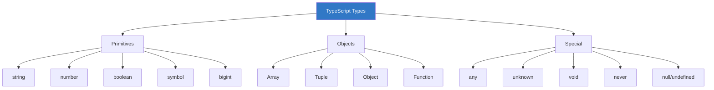
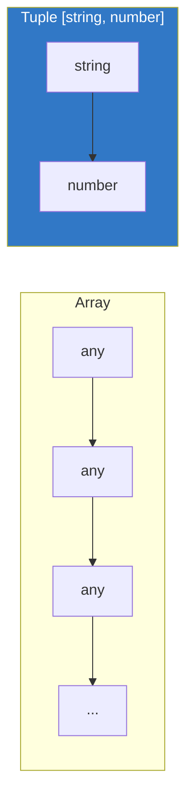
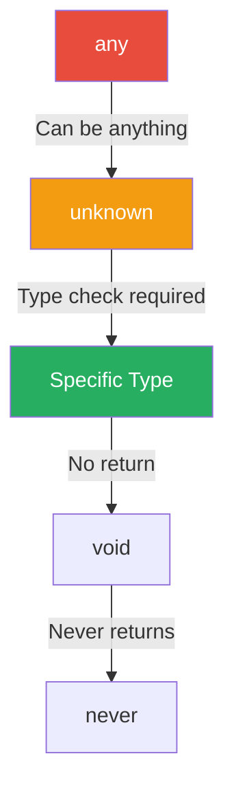

# Chapter 1.3: Basic Types

TypeScript provides several built-in types that form the foundation of type-safe code.



---

## Primitive Types

### String

```typescript
// String type
let firstName: string = "John";
let lastName: string = 'Doe';
let greeting: string = `Hello, ${firstName}`;  // Template literal

// String methods work with type safety
const upper = firstName.toUpperCase();  // TypeScript knows this returns string
```

### Number

```typescript
// Number type (all numeric values)
let age: number = 25;
let price: number = 99.99;
let hex: number = 0xff;           // Hexadecimal
let binary: number = 0b1010;      // Binary
let octal: number = 0o744;        // Octal
let big: number = 1_000_000;      // Numeric separator (readability)

// Math operations
const sum: number = age + price;  // 124.99
```

### Boolean

```typescript
// Boolean type
let isActive: boolean = true;
let hasPermission: boolean = false;

// Boolean expressions
let isAdult: boolean = age >= 18;
let canAccess: boolean = isActive && hasPermission;
```

### Symbol

```typescript
// Symbol - unique identifier
const id: symbol = Symbol("id");
const anotherId: symbol = Symbol("id");

console.log(id === anotherId);  // false - each Symbol is unique

// Usage in objects
const KEY: symbol = Symbol("key");
const obj = {
    [KEY]: "secret value"
};
```

### BigInt

```typescript
// BigInt for very large numbers (ES2020+)
let huge: bigint = 9007199254740991n;
let alsoBig: bigint = BigInt(9007199254740991);

// Operations only with other BigInts
let sum: bigint = huge + 1n;  // ✓
// let mixed = huge + 1;      // ❌ Error: can't mix bigint and number
```

---

## Arrays

```typescript
// Array types - two syntaxes
let numbers: number[] = [1, 2, 3, 4, 5];
let names: Array<string> = ["Alice", "Bob", "Charlie"];

// Mixed arrays require union types
let mixed: (string | number)[] = [1, "two", 3, "four"];

// Array methods are fully typed
const doubled = numbers.map(n => n * 2);        // number[]
const filtered = names.filter(n => n.length > 4); // string[]

// Readonly arrays
const readonlyArr: readonly number[] = [1, 2, 3];
// readonlyArr.push(4);  // ❌ Error: Property 'push' does not exist
```

---

## Tuples

Tuples are arrays with a fixed number of elements with known types.

```typescript
// Tuple: fixed length, specific types at each position
let person: [string, number] = ["Alice", 30];

// Accessing elements
const name: string = person[0];  // "Alice"
const age: number = person[1];   // 30
// const wrong = person[2];      // ❌ Error: Tuple only has 2 elements

// Named tuples (TypeScript 4.0+)
type Point = [x: number, y: number];
const coordinates: Point = [10, 20];

// Tuple with optional elements
type User = [name: string, age: number, email?: string];
let user1: User = ["Bob", 25];
let user2: User = ["Charlie", 30, "charlie@example.com"];

// Rest elements in tuples
type StringNumberBools = [string, number, ...boolean[]];
let data: StringNumberBools = ["hello", 42, true, false, true];
```



---

## Enums

Enums define a set of named constants.

### Numeric Enums

```typescript
// Numeric enum (default starts at 0)
enum Direction {
    Up,      // 0
    Down,    // 1
    Left,    // 2
    Right    // 3
}

// Custom starting value
enum Status {
    Pending = 1,
    Active = 2,
    Inactive = 3
}

// Usage
let dir: Direction = Direction.Up;
console.log(dir);                    // 0
console.log(Direction[0]);           // "Up" (reverse mapping)
```

### String Enums

```typescript
// String enum (must initialize all values)
enum Color {
    Red = "RED",
    Green = "GREEN",
    Blue = "BLUE"
}

let color: Color = Color.Red;
console.log(color);  // "RED"

// Practical example
enum HttpStatus {
    OK = 200,
    NotFound = 404,
    InternalError = 500
}

function handleResponse(status: HttpStatus) {
    if (status === HttpStatus.OK) {
        console.log("Success!");
    }
}
```

### Const Enums

```typescript
// Const enum - inlined at compile time
const enum Size {
    Small = "S",
    Medium = "M",
    Large = "L"
}

let size = Size.Medium;  // Compiled to: let size = "M";
```

> [!TIP]
> Prefer `const enum` for better performance when you don't need reverse mapping.

---

## Special Types

### Any

The `any` type disables type checking. **Avoid when possible.**

```typescript
// any - escape hatch from type system
let anything: any = "hello";
anything = 42;           // OK
anything = true;         // OK
anything.foo.bar.baz;    // OK (no error, but may crash at runtime!)

// When to use: migrating JS, dynamic content, truly unknown data
let legacyCode: any = oldLibrary.getSomething();
```

> [!WARNING]
> Using `any` defeats the purpose of TypeScript. Use `unknown` instead when possible.

### Unknown

The `unknown` type is a type-safe alternative to `any`.

```typescript
// unknown - type-safe any
let value: unknown = "hello";

// Must check type before using
// value.toUpperCase();  // ❌ Error: Object is of type 'unknown'

if (typeof value === "string") {
    console.log(value.toUpperCase());  // ✓ OK after type check
}

// Type assertion (when you're sure)
const str = value as string;
console.log(str.toUpperCase());
```

### Void

Used for functions that don't return a value.

```typescript
// void - no return value
function logMessage(message: string): void {
    console.log(message);
    // No return statement (or implicit return)
}

// Arrow function
const log = (msg: string): void => console.log(msg);

// Variable of void type (rarely useful)
let nothing: void = undefined;
```

### Never

Represents values that never occur.

```typescript
// never - function never returns
function throwError(message: string): never {
    throw new Error(message);
}

function infiniteLoop(): never {
    while (true) {
        // Loop forever
    }
}

// Exhaustive checking
type Shape = "circle" | "square";

function getArea(shape: Shape): number {
    switch (shape) {
        case "circle": return 3.14 * 10 * 10;
        case "square": return 10 * 10;
        default:
            // If we add a new shape but forget to handle it,
            // TypeScript will error because shape is not assignable to never
            const exhaustiveCheck: never = shape;
            return exhaustiveCheck;
    }
}
```



### Null and Undefined

```typescript
// With strictNullChecks enabled (recommended)
let value: string = "hello";
// value = null;      // ❌ Error
// value = undefined; // ❌ Error

// Explicit nullable types
let nullableString: string | null = null;
let optionalString: string | undefined = undefined;

// Optional chaining for nullable values
interface User {
    name: string;
    address?: {
        city: string;
    };
}

function getCity(user: User): string | undefined {
    return user.address?.city;  // Safe access
}

// Nullish coalescing
const city = user.address?.city ?? "Unknown";  // Default if null/undefined
```

---

## Object Type

```typescript
// Object type - non-primitive values
let obj: object = { name: "Alice" };
obj = [1, 2, 3];      // OK - arrays are objects
obj = () => {};        // OK - functions are objects
// obj = "string";     // ❌ Error - string is a primitive

// Inline object type
let user: { name: string; age: number } = {
    name: "Bob",
    age: 30
};

// Optional and readonly properties
let config: { 
    readonly id: number;
    name: string;
    value?: number;  // optional
} = {
    id: 1,
    name: "Config"
};

// config.id = 2;  // ❌ Error: Cannot assign to 'id' because it is a read-only property
```

---

## Type Assertions

Tell TypeScript you know better than the type checker.

```typescript
// Type assertion - two syntaxes
let someValue: unknown = "this is a string";

// Syntax 1: 'as' keyword (recommended)
let strLength1: number = (someValue as string).length;

// Syntax 2: angle-bracket (doesn't work in JSX)
let strLength2: number = (<string>someValue).length;

// DOM element assertion
const input = document.querySelector("input") as HTMLInputElement;
const value = input.value;

// Non-null assertion (use sparingly!)
function getValue(id: string): string | null {
    return document.getElementById(id)?.textContent ?? null;
}

const element = getValue("title")!;  // ! asserts non-null
console.log(element.length);         // No null check needed
```

> [!CAUTION]
> Type assertions bypass TypeScript's safety. Use only when you're absolutely sure about the type.

---

## Summary

| Type | Description | Example |
|------|-------------|---------|
| `string` | Text data | `"hello"` |
| `number` | Numeric values | `42`, `3.14` |
| `boolean` | True/false | `true`, `false` |
| `array` | List of values | `number[]`, `string[]` |
| `tuple` | Fixed-length array | `[string, number]` |
| `enum` | Named constants | `enum Color { Red, Blue }` |
| `any` | Disable type checking | Avoid! |
| `unknown` | Type-safe any | Check type before use |
| `void` | No return value | `(): void => {}` |
| `never` | Never returns | Throw, infinite loop |
| `null` | Null value | `null` |
| `undefined` | Undefined value | `undefined` |

---

[← Previous Chapter](../1.2-setup-configuration/README.md) | [Next Chapter →](../1.4-type-inference/README.md)
