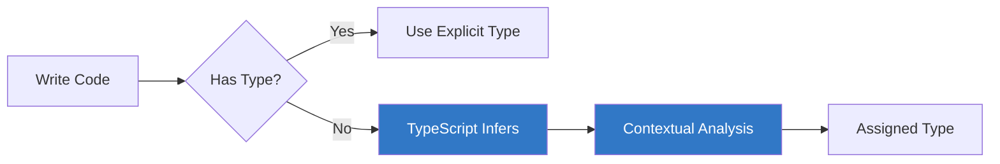
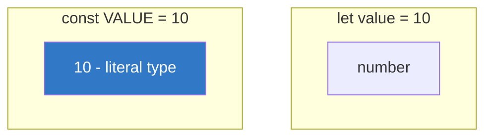
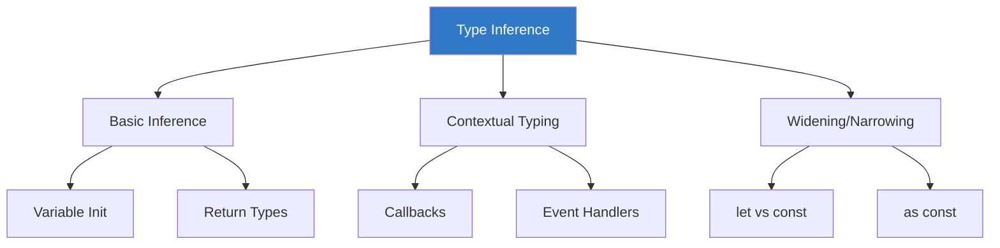

# Chapter 1.4: Type Inference

TypeScript is smart enough to figure out types automatically in many situations. This feature is called **type inference**.



---

## Basic Inference

### Variable Initialization

TypeScript infers types from initial values:

```typescript
// TypeScript infers these types automatically
let name = "Alice";          // inferred as: string
let age = 30;                // inferred as: number
let isActive = true;         // inferred as: boolean
let items = [1, 2, 3];       // inferred as: number[]
let mixed = [1, "two", 3];   // inferred as: (string | number)[]

// Hover over variables in VS Code to see inferred types!
```

### Const vs Let

```typescript
// let - infers the general type
let count = 10;              // type: number
count = 20;                  // OK

// const - infers the literal type
const MAX = 100;             // type: 100 (literal type)
const STATUS = "active";     // type: "active" (not string)

// This is why const objects are mutable
const user = { name: "Bob" };// type: { name: string }
user.name = "Alice";         // OK - object content can change
```



---

## Function Return Type Inference

TypeScript infers return types from the function body:

```typescript
// Return type inferred as: string
function greet(name: string) {
    return `Hello, ${name}!`;
}

// Return type inferred as: number
function add(a: number, b: number) {
    return a + b;
}

// Return type inferred as: number | undefined
function findValue(arr: number[], target: number) {
    for (const val of arr) {
        if (val === target) return val;
    }
    // Implicit undefined return
}

// Return type inferred as: void
function logMessage(msg: string) {
    console.log(msg);
}
```

> [!TIP]
> For public APIs and library functions, explicitly declare return types for better documentation and safety.

---

## Contextual Typing

TypeScript uses context to infer types:

### Callback Functions

```typescript
// Array methods provide context
const numbers = [1, 2, 3, 4, 5];

// 'num' is inferred as number based on array type
const doubled = numbers.map(num => num * 2);

// 'word' is inferred as string
const words = ["hello", "world"];
const upper = words.map(word => word.toUpperCase());

// Event handlers
document.addEventListener("click", event => {
    // 'event' is inferred as MouseEvent
    console.log(event.clientX, event.clientY);
});

window.addEventListener("keydown", event => {
    // 'event' is inferred as KeyboardEvent
    console.log(event.key);
});
```

### Assignment Context

```typescript
// Context from assignment target
type Person = {
    name: string;
    age: number;
};

// Object literal gets type from assignment
const person: Person = {
    name: "Alice",  // must be string
    age: 30         // must be number
};

// Array with specific type
const names: string[] = [];
names.push("Bob");
// names.push(123);  // ❌ Error
```

---

## Best Practices for Inference

### Let TypeScript Infer When Obvious

```typescript
// ✓ Good - type is obvious
const message = "Hello";           // obvious: string
const count = 42;                  // obvious: number
const isReady = false;             // obvious: boolean
const items = ["a", "b"];          // obvious: string[]

// ✗ Redundant - unnecessary explicit types
const message: string = "Hello";   // redundant
const count: number = 42;          // redundant
```

### Be Explicit When Types Are Complex

```typescript
// ✓ Good - explicit for complex types
type ApiResponse = {
    data: User[];
    pagination: {
        page: number;
        total: number;
    };
};

function fetchUsers(): Promise<ApiResponse> {
    // Explicit return type clarifies intent
    return fetch("/api/users").then(r => r.json());
}

// ✓ Good - explicit for function parameters
function process(input: string | number): string {
    // Return type can be inferred, but explicit is clearer
    return String(input);
}
```

### Use Explicit Types for Empty Collections

```typescript
// ✗ Bad - inferred as never[]
const items = [];
// items.push("test");  // ❌ Error

// ✓ Good - explicit type for empty arrays
const items: string[] = [];
items.push("test");  // OK

// ✓ Good - explicit type for empty objects
const cache: Record<string, number> = {};
cache["key"] = 42;  // OK
```

---

## Type Widening and Narrowing

### Widening

TypeScript widens literal types in mutable contexts:

```typescript
const x = "hello";    // type: "hello" (literal)
let y = "hello";      // type: string (widened)

const obj = {
    name: "Alice",    // name is string, not "Alice"
    age: 30           // age is number, not 30
};

// Prevent widening with 'as const'
const exactObj = {
    name: "Alice",
    age: 30
} as const;
// type: { readonly name: "Alice"; readonly age: 30 }
```

### The `as const` Assertion

```typescript
// Without as const
const config = {
    endpoint: "/api",
    method: "GET"
};
// type: { endpoint: string; method: string }

// With as const
const strictConfig = {
    endpoint: "/api",
    method: "GET"
} as const;
// type: { readonly endpoint: "/api"; readonly method: "GET" }

// Useful for arrays too
const directions = ["up", "down", "left", "right"] as const;
// type: readonly ["up", "down", "left", "right"]
type Direction = typeof directions[number];  // "up" | "down" | "left" | "right"
```

---

## Common Inference Patterns

### Object Destructuring

```typescript
const user = {
    name: "Alice",
    age: 30,
    email: "alice@example.com"
};

// TypeScript infers destructured variable types
const { name, age } = user;
// name: string, age: number

// With defaults (affects inference)
const { name: userName, role = "user" } = user;
// userName: string, role: string
```

### Array Destructuring

```typescript
const coords = [10, 20, 30];
const [x, y, z] = coords;
// x, y, z: number

// Tuple destructuring preserves specific types
const tuple: [string, number] = ["hello", 42];
const [greeting, count] = tuple;
// greeting: string, count: number
```

### Rest Parameters

```typescript
// Rest parameter inferred from arguments
function sum(...numbers: number[]) {
    return numbers.reduce((a, b) => a + b, 0);
}

// TypeScript infers this works
const result = sum(1, 2, 3, 4, 5);  // result: number
```

---

## Inference Limits

Sometimes TypeScript can't infer types:

```typescript
// ❌ Type any[] - no initial value to infer from
const arr = [];

// ❌ Parameter type required - no context available
function process(input) {       // Error with noImplicitAny
    return input.trim();
}

// ❌ Generic function - needs type parameter
function identity<T>(arg: T): T {
    return arg;
}
identity("hello");  // inference works here
identity(42);       // TypeScript infers T = number
```

---

## Summary



| Concept | Description |
|---------|-------------|
| Type Inference | TypeScript automatically determines types |
| Contextual Typing | Types inferred from usage context |
| Widening | Literal types expand to general types |
| `as const` | Prevents widening, creates literal types |
| Best Practice | Let TS infer obvious types, be explicit for complex ones |

---

[← Previous Chapter](../1.3-basic-types/README.md) | [Next Chapter →](../1.5-type-annotations/README.md)
