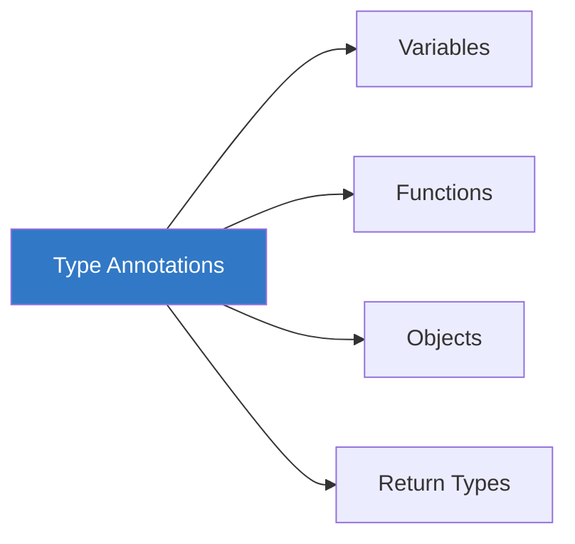
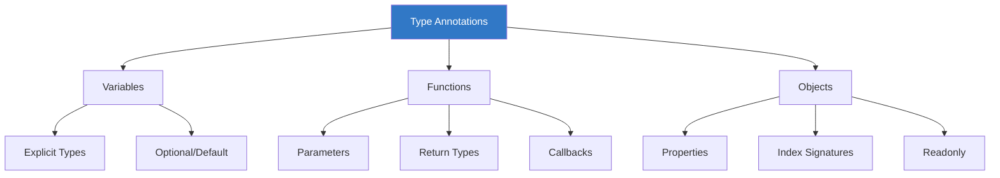

# Chapter 1.5: Type Annotations

Type annotations are explicit type declarations that tell TypeScript exactly what type a value should have.



---

## Variable Annotations

### Basic Syntax

```typescript
// Syntax: let/const variableName: Type = value;
let username: string = "alice";
let age: number = 25;
let isActive: boolean = true;
let tags: string[] = ["ts", "js"];
```

### When to Use Variable Annotations

```typescript
// ✓ Use when initializing to null/undefined
let user: User | null = null;
let config: Config | undefined;

// ✓ Use for empty collections
let items: string[] = [];
let cache: Map<string, number> = new Map();

// ✓ Use when type can't be inferred
let value: number | string;  // Declared without initial value

// ✗ Skip when type is obvious from value
let name = "Bob";  // Clearly a string
let count = 42;    // Clearly a number
```

---

## Function Parameter Annotations

Function parameters **always need type annotations** (unless inference is possible from context).

### Basic Function Parameters

```typescript
// All parameters need types
function greet(name: string): void {
    console.log(`Hello, ${name}!`);
}

function add(a: number, b: number): number {
    return a + b;
}

function createUser(name: string, age: number, email: string): void {
    console.log({ name, age, email });
}
```

### Optional Parameters

```typescript
// Optional parameter with ?
function greet(name: string, title?: string): string {
    if (title) {
        return `Hello, ${title} ${name}!`;
    }
    return `Hello, ${name}!`;
}

greet("Alice");           // "Hello, Alice!"
greet("Alice", "Dr.");    // "Hello, Dr. Alice!"
```

### Default Parameters

```typescript
// Default values provide both type and fallback
function greet(name: string, greeting: string = "Hello"): string {
    return `${greeting}, ${name}!`;
}

greet("Bob");            // "Hello, Bob!"
greet("Bob", "Hi");      // "Hi, Bob!"

// Complex defaults
function createConfig(
    timeout: number = 5000,
    retries: number = 3,
    debug: boolean = false
): Config {
    return { timeout, retries, debug };
}
```

### Rest Parameters

```typescript
// Rest parameters with array type
function sum(...numbers: number[]): number {
    return numbers.reduce((acc, n) => acc + n, 0);
}

sum(1, 2, 3);       // 6
sum(10, 20, 30, 40); // 100

// Rest with tuple type
function logInfo(message: string, ...tags: string[]): void {
    console.log(`[${tags.join(", ")}] ${message}`);
}

logInfo("Starting...", "info", "startup");
```

---

## Return Type Annotations

### Explicit Return Types

```typescript
// Explicit return type
function multiply(a: number, b: number): number {
    return a * b;
}

// Void return type
function log(message: string): void {
    console.log(message);
    // No return (or undefined return)
}

// Return union types
function findUser(id: number): User | null {
    const user = database.find(u => u.id === id);
    return user || null;
}
```

### When to Use Return Type Annotations

```typescript
// ✓ Public API functions
export function calculateTotal(items: Item[]): number {
    return items.reduce((sum, item) => sum + item.price, 0);
}

// ✓ Complex return types
function processData(data: unknown): ProcessResult | ValidationError {
    // Complex logic...
}

// ✓ Async functions
async function fetchUser(id: number): Promise<User> {
    const response = await fetch(`/api/users/${id}`);
    return response.json();
}

// ✗ Simple internal functions (inference is fine)
const add = (a: number, b: number) => a + b;  // Returns number
```

---

## Object Type Annotations

### Inline Object Types

```typescript
// Inline object type
let user: { name: string; age: number } = {
    name: "Alice",
    age: 30
};

// With optional properties
let config: { 
    host: string; 
    port: number; 
    ssl?: boolean;  // Optional
} = {
    host: "localhost",
    port: 3000
};

// Readonly properties
let point: { 
    readonly x: number; 
    readonly y: number; 
} = { x: 10, y: 20 };

// point.x = 30;  // ❌ Error: Cannot assign to 'x' because it is a read-only property
```

### Index Signatures

```typescript
// String index signature
let dictionary: { [key: string]: number } = {
    apples: 5,
    oranges: 10,
    bananas: 7
};

dictionary["grapes"] = 15;  // OK

// Number index signature
let ranking: { [index: number]: string } = {
    0: "Gold",
    1: "Silver",
    2: "Bronze"
};
```

---

## Function Type Annotations

### Function Type Expressions

```typescript
// Variable with function type
let greetFn: (name: string) => string;

greetFn = (name) => `Hello, ${name}!`;

// Arrow function with types
const add: (a: number, b: number) => number = (a, b) => a + b;

// Callback parameter
function process(
    data: string,
    callback: (result: string) => void
): void {
    const result = data.toUpperCase();
    callback(result);
}
```

### Call Signatures

```typescript
// Object with callable signature
type GreetFunction = {
    (name: string): string;
    defaultGreeting: string;
};

const greet: GreetFunction = (name) => `Hello, ${name}!`;
greet.defaultGreeting = "Hello";
```

---

## Array and Tuple Annotations

### Array Annotations

```typescript
// Two equivalent syntaxes
let numbers: number[] = [1, 2, 3];
let strings: Array<string> = ["a", "b", "c"];

// Multi-dimensional arrays
let matrix: number[][] = [
    [1, 2, 3],
    [4, 5, 6]
];

// Array of objects
let users: { name: string; age: number }[] = [
    { name: "Alice", age: 30 },
    { name: "Bob", age: 25 }
];

// Readonly array
let frozen: readonly number[] = [1, 2, 3];
// frozen.push(4);  // ❌ Error
```

### Tuple Annotations

```typescript
// Fixed-length tuple
let point: [number, number] = [10, 20];
let entry: [string, number] = ["count", 42];

// Named tuple elements
type Coordinate = [x: number, y: number, z?: number];
let position: Coordinate = [10, 20];
let position3D: Coordinate = [10, 20, 30];

// Tuple with rest
type StringNumberBools = [string, number, ...boolean[]];
let data: StringNumberBools = ["hello", 42, true, false, true];
```

---

## Type Assertions vs Annotations

```typescript
// Type Annotation - declares what type to expect
let value: string = "hello";

// Type Assertion - tells TypeScript "trust me, I know better"
const input = document.querySelector("input") as HTMLInputElement;
const value2 = <string>someUnknownValue;  // Angle-bracket syntax

// When to use each:
// ✓ Annotation: When declaring variables, parameters, return types
// ✓ Assertion: When you know more than TypeScript (DOM, external data)
```

> [!WARNING]
> Type assertions bypass TypeScript's type checking. Use sparingly and only when necessary.

---

## Complex Type Annotations

### Union Types

```typescript
// Variable can be multiple types
let id: string | number;
id = "abc123";
id = 123;

// Function parameter
function formatId(id: string | number): string {
    if (typeof id === "string") {
        return id.toUpperCase();
    }
    return id.toString().padStart(5, "0");
}
```

### Intersection Types

```typescript
// Combine multiple types
type Person = { name: string };
type Employee = { employeeId: number };

type Staff = Person & Employee;

const staff: Staff = {
    name: "Alice",
    employeeId: 12345
};
```

### Generic Annotations

```typescript
// Generic function
function identity<T>(arg: T): T {
    return arg;
}

// Generic with constraint
function getLength<T extends { length: number }>(item: T): number {
    return item.length;
}

// Using generics
identity<string>("hello");  // Explicit
identity(42);               // Inferred as identity<number>
```

---

## Best Practices

### Do's ✓

```typescript
// ✓ Annotate function parameters
function process(data: ProcessData): Result { ... }

// ✓ Annotate when type isn't clear
let config: AppConfig | null = null;

// ✓ Annotate public API return types
export function fetchUsers(): Promise<User[]> { ... }

// ✓ Use type aliases for complex types
type UserMap = Map<string, User>;
let users: UserMap = new Map();
```

### Don'ts ✗

```typescript
// ✗ Don't annotate obvious types
const name: string = "Alice";  // Redundant
const count: number = 42;      // Redundant

// ✗ Don't use 'any' to silence errors
function process(data: any) { ... }  // Loses type safety

// ✗ Don't over-annotate
const add: (a: number, b: number) => number = (a: number, b: number): number => {
    return a + b;
};
// Simpler: const add = (a: number, b: number) => a + b;
```

---

## Summary



| Context | Annotation Required? |
|---------|---------------------|
| Variable with initial value | Usually no (inference) |
| Empty array/object | Yes |
| Function parameters | Yes (usually) |
| Return types | Recommended for APIs |
| Object properties | Depends on context |

---

[← Previous Chapter](../1.4-type-inference/README.md) | [Next Module →](../../MODULE-2-INTERMEDIATE/2.1-interfaces/README.md)
