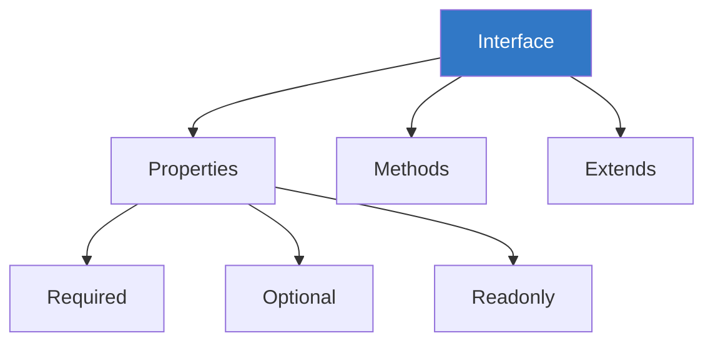
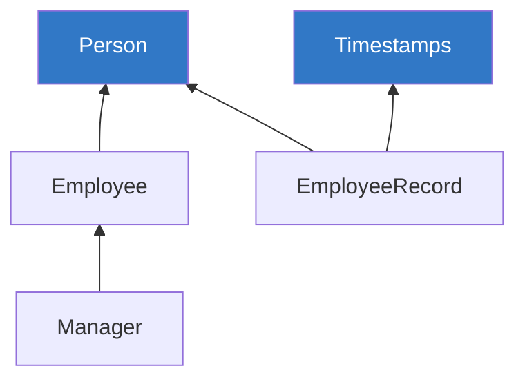

# Chapter 2.1: Interfaces

Interfaces define the shape of objects, providing a contract that values must adhere to.



---

## Basic Interface Syntax

```typescript
// Define an interface
interface User {
    id: number;
    name: string;
    email: string;
}

// Use the interface
const user: User = {
    id: 1,
    name: "Alice",
    email: "alice@example.com"
};

// Missing property = Error
const badUser: User = {
    id: 2,
    name: "Bob"
    // ❌ Error: Property 'email' is missing
};
```

---

## Optional Properties

```typescript
interface Config {
    host: string;
    port: number;
    ssl?: boolean;        // Optional
    timeout?: number;     // Optional
}

// All valid
const config1: Config = { host: "localhost", port: 3000 };
const config2: Config = { host: "localhost", port: 3000, ssl: true };
const config3: Config = { host: "localhost", port: 3000, ssl: true, timeout: 5000 };
```

---

## Readonly Properties

```typescript
interface Point {
    readonly x: number;
    readonly y: number;
}

const point: Point = { x: 10, y: 20 };
// point.x = 30;  // ❌ Error: Cannot assign to 'x' because it is read-only

// Readonly utility type
interface User {
    id: number;
    name: string;
}

const frozenUser: Readonly<User> = { id: 1, name: "Alice" };
// frozenUser.name = "Bob";  // ❌ Error
```

---

## Index Signatures

For objects with dynamic keys:

```typescript
// String index signature
interface StringDictionary {
    [key: string]: string;
}

const dict: StringDictionary = {
    hello: "world",
    foo: "bar"
};

dict["newKey"] = "newValue";  // OK

// Number index signature
interface NumberArray {
    [index: number]: string;
}

const arr: NumberArray = ["a", "b", "c"];

// Mixed with specific properties
interface Hybrid {
    name: string;                    // Required property
    [key: string]: string | number;  // Index signature must be compatible
    length: number;                  // Specific property
}
```

---

## Method Signatures

```typescript
interface Calculator {
    // Method shorthand
    add(a: number, b: number): number;
    
    // Property with function type
    subtract: (a: number, b: number) => number;
    
    // Optional method
    divide?(a: number, b: number): number;
}

const calc: Calculator = {
    add(a, b) {
        return a + b;
    },
    subtract: (a, b) => a - b
    // divide is optional, can omit
};
```

---

## Extending Interfaces

```typescript
// Base interface
interface Person {
    name: string;
    age: number;
}

// Extend single interface
interface Employee extends Person {
    employeeId: number;
    department: string;
}

const employee: Employee = {
    name: "Alice",
    age: 30,
    employeeId: 12345,
    department: "Engineering"
};

// Extend multiple interfaces
interface Timestamps {
    createdAt: Date;
    updatedAt: Date;
}

interface EmployeeRecord extends Person, Timestamps {
    employeeId: number;
}
```



---

## Interface vs Type Alias

### Similarities

```typescript
// Both can define object shapes
interface UserInterface {
    name: string;
    age: number;
}

type UserType = {
    name: string;
    age: number;
};

// Both work the same way
const user1: UserInterface = { name: "Alice", age: 30 };
const user2: UserType = { name: "Bob", age: 25 };
```

### Key Differences

| Feature | Interface | Type Alias |
|---------|-----------|------------|
| Extend/Inherit | `extends` | `&` (intersection) |
| Declaration Merging | ✓ Yes | ✗ No |
| Use with primitives | ✗ No | ✓ Yes |
| Computed properties | ✗ No | ✓ Yes |

```typescript
// Declaration Merging (interfaces only)
interface Window {
    title: string;
}

interface Window {
    count: number;
}

// Window now has both title and count

// Type aliases cannot be re-declared
type User = { name: string };
// type User = { age: number };  // ❌ Error: Duplicate identifier

// Type aliases can do more
type StringOrNumber = string | number;  // Union
type Point = [number, number];           // Tuple
type Callback = () => void;              // Function
```

### When to Use Which

```typescript
// ✓ Use interface for:
// - Object shapes
// - Class implementations
// - Declaration merging (library augmentation)
interface UserService {
    getUser(id: number): User;
    createUser(data: UserData): User;
}

// ✓ Use type for:
// - Unions, tuples, primitives
// - Complex type transformations
// - When you need computed properties
type Status = "pending" | "active" | "inactive";
type Pair<T> = [T, T];
type PropType<T, K extends keyof T> = T[K];
```

---

## Implementing Interfaces

```typescript
interface Printable {
    print(): void;
}

interface Serializable {
    serialize(): string;
}

// Class implementing interfaces
class Document implements Printable, Serializable {
    constructor(private content: string) {}
    
    print(): void {
        console.log(this.content);
    }
    
    serialize(): string {
        return JSON.stringify({ content: this.content });
    }
}

// Must implement ALL interface members
class BadDocument implements Printable {
    // ❌ Error: Class 'BadDocument' incorrectly implements interface 'Printable'.
    // Property 'print' is missing.
}
```

---

## Function Interfaces

```typescript
// Interface for function
interface SearchFunc {
    (source: string, subString: string): boolean;
}

const search: SearchFunc = (src, sub) => {
    return src.includes(sub);
};

// Interface with call signature and properties
interface Counter {
    (start: number): number;
    interval: number;
    reset(): void;
}

function createCounter(): Counter {
    const counter = ((start: number) => start + counter.interval) as Counter;
    counter.interval = 1;
    counter.reset = () => { counter.interval = 1; };
    return counter;
}
```

---

## Generic Interfaces

```typescript
// Generic interface
interface Container<T> {
    value: T;
    getValue(): T;
    setValue(value: T): void;
}

// Implementation
class Box<T> implements Container<T> {
    constructor(public value: T) {}
    
    getValue(): T {
        return this.value;
    }
    
    setValue(value: T): void {
        this.value = value;
    }
}

const numberBox = new Box<number>(42);
const stringBox = new Box<string>("hello");

// Generic interface with default
interface Response<T = unknown> {
    data: T;
    status: number;
}

const res1: Response<User[]> = { data: [], status: 200 };
const res2: Response = { data: "anything", status: 200 };  // T = unknown
```

---

## Best Practices

> [!TIP]
> **Prefer interfaces for objects** - They're more extensible and better for class contracts.

> [!TIP]
> **Use `readonly` for immutable data** - Prevents accidental mutations.

> [!NOTE]
> **Interfaces describe shape, not behavior** - Use classes if you need actual implementation.

> [!IMPORTANT]
> **Keep interfaces focused** - Follow Interface Segregation Principle (ISP).

```typescript
// ✗ Bad: One huge interface
interface UserOperations {
    create(): void;
    read(): void;
    update(): void;
    delete(): void;
    sendEmail(): void;
    generateReport(): void;
}

// ✓ Good: Focused interfaces
interface Readable { read(): void; }
interface Writable { create(): void; update(): void; delete(): void; }
interface Emailable { sendEmail(): void; }
interface Reportable { generateReport(): void; }
```

---

## Summary

| Concept | Description |
|---------|-------------|
| Interface | Defines object shape/contract |
| Optional `?` | Property may be undefined |
| Readonly | Property cannot be modified |
| Index Signature | Dynamic property keys |
| Extends | Inherit from other interfaces |
| Implements | Class fulfills interface contract |

---

[← Previous Module](../../MODULE-1-FUNDAMENTALS/1.5-type-annotations/README.md) | [Next Chapter →](../2.2-classes/README.md)
