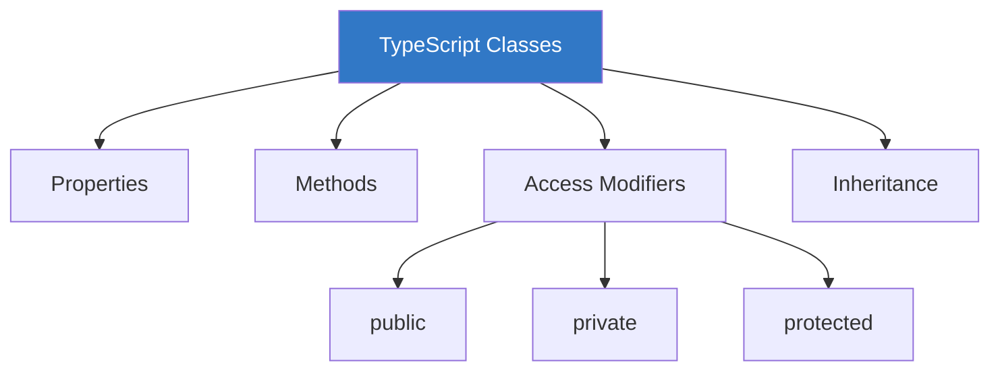
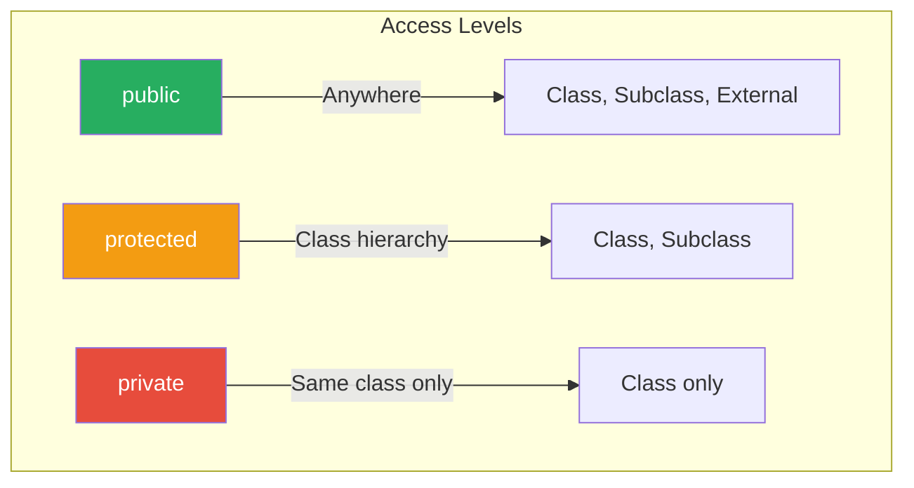
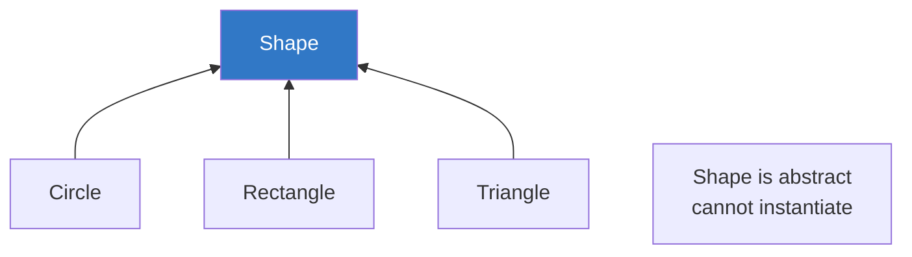

# Chapter 2.2: Classes

TypeScript enhances JavaScript classes with type annotations, access modifiers, and additional features.



---

## Basic Class Syntax

```typescript
class Person {
    // Properties with types
    name: string;
    age: number;
    
    // Constructor
    constructor(name: string, age: number) {
        this.name = name;
        this.age = age;
    }
    
    // Method
    greet(): string {
        return `Hello, I'm ${this.name}`;
    }
}

// Create instances
const person = new Person("Alice", 30);
console.log(person.greet());  // "Hello, I'm Alice"
```

---

## Parameter Properties (Shorthand)

TypeScript provides a shorthand for declaring and initializing properties:

```typescript
// Long form
class PersonLong {
    name: string;
    age: number;
    
    constructor(name: string, age: number) {
        this.name = name;
        this.age = age;
    }
}

// Shorthand with parameter properties
class Person {
    constructor(
        public name: string,
        public age: number
    ) {}
    // Properties are automatically created and assigned!
}

const person = new Person("Bob", 25);
console.log(person.name); // "Bob"
```

---

## Access Modifiers

### Public (Default)

```typescript
class User {
    public name: string;  // 'public' is optional, it's the default
    
    constructor(name: string) {
        this.name = name;
    }
    
    public greet(): void {
        console.log(`Hello, ${this.name}`);
    }
}

const user = new User("Alice");
user.name;     // ✓ Accessible
user.greet();  // ✓ Accessible
```

### Private

```typescript
class BankAccount {
    private balance: number = 0;
    
    constructor(private accountNumber: string) {}
    
    deposit(amount: number): void {
        this.balance += amount;
    }
    
    getBalance(): number {
        return this.balance;
    }
}

const account = new BankAccount("123456");
account.deposit(100);
console.log(account.getBalance());  // 100
// console.log(account.balance);    // ❌ Error: 'balance' is private
// console.log(account.accountNumber); // ❌ Error: 'accountNumber' is private
```

### Protected

```typescript
class Animal {
    protected species: string;
    
    constructor(species: string) {
        this.species = species;
    }
    
    protected makeSound(): void {
        console.log("Some sound");
    }
}

class Dog extends Animal {
    constructor() {
        super("Canine");
    }
    
    bark(): void {
        // ✓ Can access protected members in subclass
        console.log(`${this.species} says: Woof!`);
        this.makeSound();
    }
}

const dog = new Dog();
dog.bark();           // ✓ OK
// dog.species;       // ❌ Error: 'species' is protected
// dog.makeSound();   // ❌ Error: 'makeSound' is protected
```



---

## Readonly Properties

```typescript
class Config {
    readonly apiUrl: string;
    readonly maxRetries: number = 3;  // Can initialize with default
    
    constructor(url: string) {
        this.apiUrl = url;  // Can set in constructor
    }
    
    updateUrl(url: string): void {
        // this.apiUrl = url;  // ❌ Error: Cannot assign to 'apiUrl'
    }
}

const config = new Config("https://api.example.com");
// config.apiUrl = "new-url";  // ❌ Error: Cannot assign to 'apiUrl'
```

---

## Getters and Setters

```typescript
class Temperature {
    private _celsius: number = 0;
    
    // Getter
    get celsius(): number {
        return this._celsius;
    }
    
    // Setter with validation
    set celsius(value: number) {
        if (value < -273.15) {
            throw new Error("Temperature below absolute zero!");
        }
        this._celsius = value;
    }
    
    // Computed property
    get fahrenheit(): number {
        return (this._celsius * 9/5) + 32;
    }
    
    set fahrenheit(value: number) {
        this._celsius = (value - 32) * 5/9;
    }
}

const temp = new Temperature();
temp.celsius = 25;
console.log(temp.fahrenheit);  // 77

temp.fahrenheit = 100;
console.log(temp.celsius);     // 37.777...
```

---

## Static Members

```typescript
class MathUtils {
    static PI: number = 3.14159;
    
    static square(x: number): number {
        return x * x;
    }
    
    static distance(x1: number, y1: number, x2: number, y2: number): number {
        return Math.sqrt(MathUtils.square(x2 - x1) + MathUtils.square(y2 - y1));
    }
}

// Access without instantiation
console.log(MathUtils.PI);          // 3.14159
console.log(MathUtils.square(5));   // 25
console.log(MathUtils.distance(0, 0, 3, 4));  // 5

// Static blocks (TypeScript 4.4+)
class Database {
    static connection: string;
    
    static {
        // Initialization code
        Database.connection = process.env.DB_URL || "localhost";
    }
}
```

---

## Inheritance

```typescript
// Base class
class Animal {
    constructor(public name: string) {}
    
    move(distance: number): void {
        console.log(`${this.name} moved ${distance} meters`);
    }
}

// Derived class
class Dog extends Animal {
    constructor(name: string, public breed: string) {
        super(name);  // Call parent constructor
    }
    
    bark(): void {
        console.log(`${this.name} says: Woof!`);
    }
    
    // Override parent method
    move(distance: number): void {
        console.log("Running...");
        super.move(distance);  // Call parent method
    }
}

const dog = new Dog("Buddy", "Golden Retriever");
dog.bark();      // "Buddy says: Woof!"
dog.move(10);    // "Running..." then "Buddy moved 10 meters"
```

---

## Abstract Classes

Abstract classes cannot be instantiated directly and may contain abstract methods.

```typescript
abstract class Shape {
    abstract color: string;
    
    // Abstract method - must be implemented by subclasses
    abstract getArea(): number;
    
    // Regular method - inherited by subclasses
    describe(): string {
        return `A ${this.color} shape with area ${this.getArea()}`;
    }
}

class Circle extends Shape {
    color: string = "red";
    
    constructor(public radius: number) {
        super();
    }
    
    getArea(): number {
        return Math.PI * this.radius ** 2;
    }
}

class Rectangle extends Shape {
    color: string = "blue";
    
    constructor(public width: number, public height: number) {
        super();
    }
    
    getArea(): number {
        return this.width * this.height;
    }
}

// const shape = new Shape();  // ❌ Error: Cannot create instance of abstract class
const circle = new Circle(5);
console.log(circle.describe());  // "A red shape with area 78.54..."
```



---

## Implementing Interfaces

```typescript
interface Printable {
    print(): void;
}

interface Serializable {
    toJSON(): string;
}

// Implement multiple interfaces
class Document implements Printable, Serializable {
    constructor(
        public title: string,
        public content: string
    ) {}
    
    print(): void {
        console.log(`=== ${this.title} ===\n${this.content}`);
    }
    
    toJSON(): string {
        return JSON.stringify({ title: this.title, content: this.content });
    }
}

// Class must implement ALL interface methods
class Report implements Printable {
    // ❌ Error if print() is missing
    print(): void {
        console.log("Printing report...");
    }
}
```

---

## Class Expressions

```typescript
// Class expression
const Rectangle = class {
    constructor(public width: number, public height: number) {}
    
    getArea(): number {
        return this.width * this.height;
    }
};

const rect = new Rectangle(10, 5);

// Named class expression
const Circle = class CircleClass {
    constructor(public radius: number) {}
    
    getArea(): number {
        return Math.PI * this.radius ** 2;
    }
};
```

---

## `this` Type

```typescript
class Builder {
    private value: string = "";
    
    add(text: string): this {
        this.value += text;
        return this;  // Return 'this' for chaining
    }
    
    clear(): this {
        this.value = "";
        return this;
    }
    
    build(): string {
        return this.value;
    }
}

// Fluent API with chaining
const result = new Builder()
    .add("Hello ")
    .add("World")
    .build();  // "Hello World"

// Subclass maintains type
class HTMLBuilder extends Builder {
    addTag(tag: string, content: string): this {
        return this.add(`<${tag}>${content}</${tag}>`);
    }
}

const html = new HTMLBuilder()
    .addTag("h1", "Title")
    .addTag("p", "Content")
    .build();
```

---

## Best Practices

> [!TIP]
> **Prefer `private` over `#`** - TypeScript's `private` is checked at compile time; `#` is runtime private.

> [!TIP]
> **Use parameter properties** - They reduce boilerplate for simple constructors.

> [!IMPORTANT]
> **Favor composition over inheritance** - Deep inheritance hierarchies can be hard to maintain.

> [!NOTE]
> **Abstract classes vs interfaces** - Use abstract classes when you need shared implementation; interfaces for pure contracts.

```typescript
// ✓ Good: Composition
class Engine { start(): void {} }
class Wheels { roll(): void {} }

class Car {
    constructor(
        private engine: Engine,
        private wheels: Wheels
    ) {}
}

// ✗ Questionable: Deep inheritance
class Vehicle { }
class MotorVehicle extends Vehicle { }
class Car extends MotorVehicle { }
class Sedan extends Car { }
class LuxurySedan extends Sedan { }
```

---

## Summary

| Feature | Description |
|---------|-------------|
| `public` | Accessible everywhere (default) |
| `private` | Only accessible in the class |
| `protected` | Accessible in class and subclasses |
| `readonly` | Can only be set in constructor |
| `static` | Belongs to class, not instances |
| `abstract` | Cannot instantiate, must extend |
| `extends` | Inherit from another class |
| `implements` | Fulfill an interface contract |

---

[← Previous Chapter](../2.1-interfaces/README.md) | [Next Chapter →](../2.3-functions-advanced/README.md)
