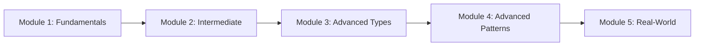
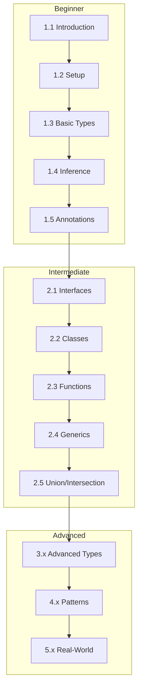

# TypeScript Learning Curriculum

A comprehensive TypeScript learning curriculum from **beginner to advanced**, featuring the latest **TypeScript 5.7** features.

## 📚 Curriculum Overview

---

## Module 1: TypeScript Fundamentals

| Chapter | Topic | Description |
|---------|-------|-------------|
| [1.1](./MODULE-1-FUNDAMENTALS/1.1-introduction/README.md) | Introduction | What is TypeScript and why use it |
| [1.2](./MODULE-1-FUNDAMENTALS/1.2-setup-configuration/README.md) | Setup & Configuration | Installing and configuring TypeScript |
| [1.3](./MODULE-1-FUNDAMENTALS/1.3-basic-types/README.md) | Basic Types | Primitives, arrays, tuples, enums |
| [1.4](./MODULE-1-FUNDAMENTALS/1.4-type-inference/README.md) | Type Inference | How TypeScript infers types |
| [1.5](./MODULE-1-FUNDAMENTALS/1.5-type-annotations/README.md) | Type Annotations | Explicit type declarations |

---

## Module 2: Intermediate TypeScript

| Chapter | Topic | Description |
|---------|-------|-------------|
| [2.1](./MODULE-2-INTERMEDIATE/2.1-interfaces/README.md) | Interfaces | Object type contracts |
| [2.2](./MODULE-2-INTERMEDIATE/2.2-classes/README.md) | Classes | OOP with TypeScript |
| [2.3](./MODULE-2-INTERMEDIATE/2.3-functions-advanced/README.md) | Advanced Functions | Overloading, callbacks, this |
| [2.4](./MODULE-2-INTERMEDIATE/2.4-generics-basics/README.md) | Generics Basics | Type parameters |
| [2.5](./MODULE-2-INTERMEDIATE/2.5-union-intersection-types/README.md) | Union & Intersection | Combining types |

---

## Module 3: Advanced Type System

| Chapter | Topic | Description |
|---------|-------|-------------|
| [3.1](./MODULE-3-ADVANCED-TYPES/3.1-advanced-generics/README.md) | Advanced Generics | Constraints, keyof, indexed access |
| [3.2](./MODULE-3-ADVANCED-TYPES/3.2-conditional-types/README.md) | Conditional Types | Type-level conditionals |
| [3.3](./MODULE-3-ADVANCED-TYPES/3.3-mapped-types/README.md) | Mapped Types | Type transformations |
| [3.4](./MODULE-3-ADVANCED-TYPES/3.4-template-literal-types/README.md) | Template Literal Types | String type manipulation |
| [3.5](./MODULE-3-ADVANCED-TYPES/3.5-type-guards-narrowing/README.md) | Type Guards & Narrowing | Runtime type checking |

---

## Module 4: Advanced Patterns

| Chapter | Topic | Description |
|---------|-------|-------------|
| [4.1](./MODULE-4-ADVANCED-PATTERNS/4.1-utility-types/README.md) | Utility Types | Partial, Pick, Omit, etc. |
| [4.2](./MODULE-4-ADVANCED-PATTERNS/4.2-declaration-files/README.md) | Declaration Files | .d.ts and @types |
| [4.3](./MODULE-4-ADVANCED-PATTERNS/4.3-decorators/README.md) | Decorators | Metaprogramming |
| [4.4](./MODULE-4-ADVANCED-PATTERNS/4.4-modules-namespaces/README.md) | Modules & Namespaces | Code organization |
| [4.5](./MODULE-4-ADVANCED-PATTERNS/4.5-typescript-5.7-features/README.md) | TypeScript 5.7 | Latest features |

---

## Module 5: Real-World Applications

| Chapter | Topic | Description |
|---------|-------|-------------|
| [5.1](./MODULE-5-REAL-WORLD/5.1-typescript-react/README.md) | TypeScript + React | React components with types |
| [5.2](./MODULE-5-REAL-WORLD/5.2-typescript-nodejs/README.md) | TypeScript + Node.js | Backend development |
| [5.3](./MODULE-5-REAL-WORLD/5.3-testing-typescript/README.md) | Testing | Jest and type testing |
| [5.4](./MODULE-5-REAL-WORLD/5.4-performance-best-practices/README.md) | Performance & Best Practices | Optimization tips |
| [5.5](./MODULE-5-REAL-WORLD/5.5-migration-strategies/README.md) | Migration Strategies | JS to TS migration |

---

## 🎯 Learning Path

---

## 📋 Prerequisites

- Basic JavaScript knowledge
- Node.js installed (v18+)
- A code editor (VS Code recommended)

## 🚀 Getting Started

1. Clone this repository
2. Navigate to Module 1, Chapter 1.1
3. Follow along with each chapter
4. Complete the exercises in each section

---

*Built with TypeScript 5.7 features (November 2024)*
